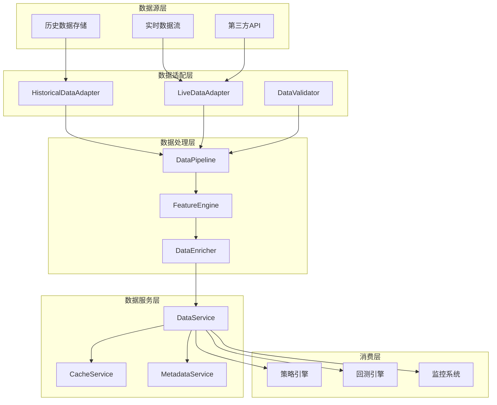

# 数据流架构设计

## 1. 设计目标

### 1.1 核心目标
1. **数据一致性**：回测和实盘使用相同的数据处理逻辑
2. **时序正确性**：确保无前视偏差，正确处理数据时序
3. **性能优化**：支持高效的数据访问和处理
4. **可扩展性**：支持多种数据源和格式
5. **数据隔离**：历史数据和实时数据清晰分离

### 1.2 设计原则
- **统一接口**：所有数据访问通过统一接口
- **时序保证**：严格的时间顺序处理
- **缓存优化**：合理的数据缓存策略
- **错误处理**：健壮的数据错误恢复
- **监控统计**：完整的数据访问监控

## 2. 整体架构

### 2.1 数据流架构图



## 3. 数据适配层设计

### 3.1 统一数据接口

```python
from abc import ABC, abstractmethod
from typing import Dict, List, Optional, Any, Callable
import pandas as pd
from datetime import datetime, timedelta

class DataAdapter(ABC):
    """数据适配器基类"""
    
    @abstractmethod
    async def get_historical_data(
        self,
        symbol: str,
        start: datetime,
        end: datetime,
        timeframe: str,
        fields: Optional[List[str]] = None
    ) -> pd.DataFrame:
        """获取历史数据"""
        pass
    
    @abstractmethod
    async def subscribe_real_time(
        self,
        symbol: str,
        timeframe: str,
        callback: Callable[[Dict[str, Any]], None]
    ) -> str:
        """订阅实时数据"""
        pass
    
    @abstractmethod
    async def unsubscribe_real_time(self, subscription_id: str) -> bool:
        """取消订阅实时数据"""
        pass
    
    @abstractmethod
    async def get_current_price(self, symbol: str) -> Optional[float]:
        """获取当前价格"""
        pass
    
    @abstractmethod
    async def get_available_symbols(self) -> List[str]:
        """获取可用标的列表"""
        pass
    
    @abstractmethod
    async def get_data_metadata(self, symbol: str, timeframe: str) -> Dict[str, Any]:
        """获取数据元数据"""
        pass
```

### 3.2 历史数据适配器

```python
class HistoricalDataAdapter(DataAdapter):
    """历史数据适配器"""
    
    def __init__(self, storage_backend: StorageBackend, config: HistoricalDataConfig):
        self.storage = storage_backend
        self.config = config
        self.cache = DataCache(config.cache_size)
        
    async def get_historical_data(
        self,
        symbol: str,
        start: datetime,
        end: datetime,
        timeframe: str,
        fields: Optional[List[str]] = None
    ) -> pd.DataFrame:
        """获取历史数据"""
        # 1. 检查缓存
        cache_key = self._generate_cache_key(symbol, start, end, timeframe, fields)
        cached_data = self.cache.get(cache_key)
        if cached_data is not None:
            return cached_data
        
        # 2. 从存储加载数据
        try:
            data = await self.storage.load_data(
                symbol=symbol,
                start=start,
                end=end,
                timeframe=timeframe,
                fields=fields
            )
            
            # 3. 数据验证和清洗
            cleaned_data = await self._clean_and_validate_data(data, symbol, timeframe)
            
            # 4. 缓存数据
            self.cache.set(cache_key, cleaned_data)
            
            return cleaned_data
            
        except Exception as e:
            raise DataLoadError(f"加载历史数据失败: {symbol} {timeframe} {start}-{end}: {e}")
    
    async def _clean_and_validate_data(self, data: pd.DataFrame, symbol: str, timeframe: str) -> pd.DataFrame:
        """数据清洗和验证"""
        if data.empty:
            return data
        
        # 1. 检查必要字段
        required_columns = ["open", "high", "low", "close", "volume"]
        for col in required_columns:
            if col not in data.columns:
                raise DataValidationError(f"缺失必要字段: {col}")
        
        # 2. 处理缺失值
        data = data.copy()
        for col in required_columns:
            if data[col].isnull().any():
                # 使用前向填充，如果开头缺失则使用后向填充
                data[col] = data[col].ffill().bfill()
        
        # 3. 检查价格合理性
        self._validate_price_ranges(data, symbol)
        
        # 4. 检查时间连续性
        self._validate_time_continuity(data, timeframe)
        
        # 5. 添加元数据
        data["symbol"] = symbol
        data["timeframe"] = timeframe
        
        return data
```

### 3.3 实时数据适配器

```python
class LiveDataAdapter(DataAdapter):
    """实时数据适配器"""
    
    def __init__(self, data_stream: DataStream, config: LiveDataConfig):
        self.data_stream = data_stream
        self.config = config
        self.subscriptions: Dict[str, List[Subscription]] = {}
        self.price_cache: Dict[str, float] = {}
        self.last_update: Dict[str, datetime] = {}
        
    async def subscribe_real_time(
        self,
        symbol: str,
        timeframe: str,
        callback: Callable[[Dict[str, Any]], None]
    ) -> str:
        """订阅实时数据"""
        subscription_id = f"{symbol}_{timeframe}_{uuid.uuid4().hex[:8]}"
        
        # 创建订阅
        subscription = Subscription(
            id=subscription_id,
            symbol=symbol,
            timeframe=timeframe,
            callback=callback,
            created_at=datetime.utcnow()
        )
        
        # 添加到订阅列表
        key = f"{symbol}_{timeframe}"
        if key not in self.subscriptions:
            self.subscriptions[key] = []
        self.subscriptions[key].append(subscription)
        
        # 启动数据流
        await self._ensure_data_stream(symbol, timeframe)
        
        return subscription_id
```

## 4. 时序处理与前视偏差防护

### 4.1 时序管理器

```python
class TimeSeriesManager:
    """时序管理器 - 确保正确的时间顺序"""
    
    def __init__(self, config: TimeSeriesConfig):
        self.config = config
        self.current_time: Optional[datetime] = None
        self.available_data: Dict[str, pd.DatetimeIndex] = {}
        
    def get_visible_data(self, data: pd.DataFrame, current_time: datetime) -> pd.DataFrame:
        """获取可见数据（当前时间点及之前的数据）"""
        # 确保索引是DatetimeIndex
        if not isinstance(data.index, pd.DatetimeIndex):
            return data
        
        # 过滤当前时间点及之前的数据
        visible = data[data.index <= current_time]
        
        # 更新当前时间
        if self.current_time is None or current_time > self.current_time:
            self.current_time = current_time
        
        return visible
    
    def get_bar_at_time(self, data: pd.DataFrame, target_time: datetime, 
                       tolerance: Optional[timedelta] = None) -> Optional[pd.Series]:
        """获取指定时间点的K线"""
        if tolerance is None:
            tolerance = self.config.bar_tolerance
            
        # 查找精确匹配
        if target_time in data.index:
            return data.loc[target_time]
        
        # 查找容差范围内的K线
        lower_bound = target_time - tolerance
        upper_bound = target_time + tolerance
        
        candidates = data[(data.index >= lower_bound) & (data.index <= upper_bound)]
        
        if not candidates.empty:
            # 返回最接近的K线
            time_diffs = (candidates.index - target_time).map(abs)
            closest_idx = time_diffs.idxmin()
            return candidates.loc[closest_idx]
        
        return None
```

### 4.2 前视偏差检测器

```python
class LookaheadChecker:
    """前视偏差检测器"""
    
    def __init__(self, config: LookaheadConfig):
        self.config = config
        self.violations: List[LookaheadViolation] = []
        
    def check_data(self, data: pd.DataFrame, strategy_name: str, 
                   current_time: datetime) -> List[LookaheadViolation]:
        """检查数据是否存在前视偏差"""
        violations = []
        
        # 检查每列的最大时间戳
        for col in data.columns:
            if col in ["symbol", "timeframe"]:
                continue
                
            # 获取该列的最大时间戳
            col_data = data[col].dropna()
            if col_data.empty:
                continue
                
            # 对于时间序列数据，检查索引
            if isinstance(data.index, pd.DatetimeIndex):
                max_idx_time = data.index.max()
                
                # 如果最大时间大于当前时间，存在前视偏差
                if max_idx_time > current_time:
                    violation = LookaheadViolation(
                        strategy_name=strategy_name,
                        column_name=col,
                        current_time=current_time,
                        max_data_time=max_idx_time,
                        violation_type="future_data_in_column"
                    )
                    violations.append(violation)
        
        return violations
    
    def check_indicator(self, indicator_data: pd.Series, strategy_name: str,
                       current_time: datetime) -> bool:
        """检查指标数据是否存在前视偏差"""
        if indicator_data.empty:
            return False
        
        # 获取指标数据的时间范围
        if isinstance(indicator_data.index, pd.DatetimeIndex):
            max_time = indicator_data.index.max()
            return max_time > current_time
        
        return False
```

## 5. 回测与实盘数据流对比

### 5.1 回测数据流

```
1. 历史数据存储 → HistoricalDataAdapter
2. 数据加载 → 数据缓存
3. 数据清洗 → 时间范围裁剪（warmup + 回测期）
4. 特征计算 → 增量计算
5. 时序处理 → 按时间顺序生成事件
6. 策略执行 → 事件驱动
```

### 5.2 实盘数据流

```
1. 实时数据流 → LiveDataAdapter
2. 数据接收 → 实时缓存
3. 数据预处理 → 增量更新
4. 特征计算 → 滚动计算
5. 事件生成 → 实时触发
6. 策略执行 → 事件驱动
```

### 5.3 统一数据接口

```python
@dataclass
class DataRequest:
    """数据请求"""
    symbol: str
    start: Optional[datetime] = None
    end: Optional[datetime] = None
    timeframe: str = "1d"
    fields: Optional[List[str]] = None
    include_previous: int = 0  # 包含多少根历史K线
    mode: str = "backtest"  # "backtest" 或 "live"

class UnifiedDataService:
    """统一数据服务"""
    
    def __init__(self, historical_adapter: HistoricalDataAdapter,
                 live_adapter: LiveDataAdapter, pipeline: DataPipeline):
        self.historical_adapter = historical_adapter
        self.live_adapter = live_adapter
        self.pipeline = pipeline
        
    async def get_data(self, request: DataRequest) -> pd.DataFrame:
        """统一数据获取接口"""
        if request.mode == "backtest":
            return await self._get_backtest_data(request)
        else:
            return await self._get_live_data(request)
    
    async def _get_backtest_data(self, request: DataRequest) -> pd.DataFrame:
        """获取回测数据"""
        # 1. 确定实际需要的起始时间（考虑warmup）
        start = request.start
        if request.include_previous > 0 and request.timeframe.endswith("d"):
            warmup_days = request.include_previous * 260  # 假设每年260个交易日
            warmup_start = start - timedelta(days=warmup_days)
        else:
            warmup_start = start
        
        # 2. 加载历史数据
        data = await self.historical_adapter.get_historical_data(
            symbol=request.symbol,
            start=warmup_start,
            end=request.end,
            timeframe=request.timeframe,
            fields=request.fields
        )
        
        # 3. 过滤到实际需要的范围
        if start:
            data = data[data.index >= start]
        
        return data
    
    async def _get_live_data(self, request: DataRequest) -> pd.DataFrame:
        """获取实盘数据"""
        # 1. 获取最新K线
        current_price = await self.live_adapter.get_current_price(request.symbol)
        
        if current_price is None:
            # 回退到历史数据
            return await self._get_backtest_data(request)
        
        # 2. 构建单行DataFrame
        now = datetime.utcnow()
        data = pd.DataFrame({
            "open": [current_price],
            "high": [current_price],
            "low": [current_price],
            "close": [current_price],
            "volume": [0]
        }, index=pd.DatetimeIndex([now]))
        data["symbol"] = request.symbol
        
        return data
```

## 6. 数据缓存策略

### 6.1 缓存层级

```python
class DataCache:
    """多级数据缓存"""
    
    def __init__(self, config: CacheConfig):
        self.config = config
        self.memory_cache: Dict[str, CacheEntry] = {}
        self.disk_cache: Optional[DiskCache] = None
        
    async def get(self, key: str) -> Optional[pd.DataFrame]:
        """获取缓存数据"""
        # 1. 检查内存缓存
        if key in self.memory_cache:
            entry = self.memory_cache[key]
            if not entry.is_expired():
                return entry.data
        
        # 2. 检查磁盘缓存
        if self.disk_cache:
            disk_data = await self.disk_cache.get(key)
            if disk_data is not None:
                # 回填到内存缓存
                self.memory_cache[key] = CacheEntry(
                    data=disk_data,
                    created_at=datetime.utcnow(),
                    ttl=self.config.memory_ttl
                )
                return disk_data
        
        return None
    
    async def set(self, key: str, data: pd.DataFrame):
        """设置缓存数据"""
        entry = CacheEntry(
            data=data,
            created_at=datetime.utcnow(),
            ttl=self.config.memory_ttl
        )
        
        # 设置内存缓存
        self.memory_cache[key] = entry
        
        # 磁盘缓存（如果启用）
        if self.disk_cache and len(data) > self.config.min_size_for_disk:
            await self.disk_cache.set(key, data)
        
        # 清理过期缓存
        self._cleanup_expired()
```

## 7. 监控指标

### 7.1 数据服务指标

```python
@dataclass
class DataServiceMetrics:
    """数据服务监控指标"""
    total_requests: int = 0
    cache_hits: int = 0
    cache_misses: int = 0
    errors: int = 0
    avg_latency_ms: float = 0.0
    data_quality_score: float = 1.0
    
    @property
    def cache_hit_rate(self) -> float:
        """缓存命中率"""
        total = self.cache_hits + self.cache_misses
        if total == 0:
            return 0.0
        return self.cache_hits / total
```

## 8. 错误处理

### 8.1 自定义异常

```python
class DataServiceError(Exception):
    """数据服务异常基类"""
    def __init__(self, message: str, details: Optional[Dict] = None):
        super().__init__(message)
        self.details = details or {}

class DataLoadError(DataServiceError):
    """数据加载失败"""
    pass

class DataValidationError(DataServiceError):
    """数据验证失败"""
    pass

class DataTimeoutError(DataServiceError):
    """数据获取超时"""
    pass

class DataNotFoundError(DataServiceError):
    """数据不存在"""
    pass
```

### 8.2 错误处理策略

```python
async def handle_data_error(self, error: DataServiceError, 
                           request: DataRequest) -> Optional[pd.DataFrame]:
    """处理数据错误"""
    # 1. 记录错误
    self.metrics.errors += 1
    logger.error(f"数据获取失败: {request.symbol}, 错误: {error}")
    
    # 2. 根据错误类型处理
    if isinstance(error, DataNotFoundError):
        # 数据不存在，尝试其他数据源
        return await self._try_fallback_source(request)
    
    elif isinstance(error, DataTimeoutError):
        # 超时，等待重试
        await asyncio.sleep(self.config.retry_delay)
        return await self.get_data(request)  # 重试
    
    elif isinstance(error, DataValidationError):
        # 数据验证失败，返回空数据
        return pd.DataFrame()
    
    else:
        # 其他错误，尝试降级处理
        return await self._handle_degraded_mode(request)