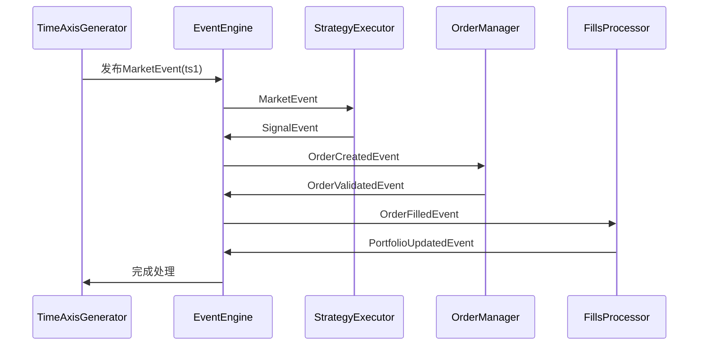

# 统一事件驱动架构重构迁移路线图

## 1. 执行摘要

本文档提供了将当前系统重构为统一事件驱动架构的详细迁移路线图。目标是通过分阶段实施，使回测流程和实盘交易流程基本一致，提高代码复用率，减少前视偏差，并提升系统的可维护性和可靠性。

## 2. 当前系统评估

### 2.1 代码规模统计

| 组件 | 文件数 | 代码行数(估算) | 复杂度 |
|------|--------|----------------|--------|
| 回测引擎 | 8 | 2,500 | 高 |
| 策略系统 | 12 | 3,000 | 中高 |
| 数据管理 | 15 | 4,000 | 高 |
| 执行引擎 | 8 | 2,000 | 中 |
| 事件引擎 | 1 | 200 | 低 |
| 工具类 | 20 | 3,000 | 中 |
| **总计** | **64** | **14,700** | - |

### 2.2 关键技术债务

1. **架构问题**
   - 回测和实盘使用完全不同的代码路径
   - 事件引擎存在但未被回测系统使用
   - 缺乏统一的状态管理

2. **代码问题**
   - 存在全局变量和单例模式
   - 类型注解不完整
   - 错误处理不一致

3. **测试问题**
   - 缺乏集成测试
   - 回测结果验证不足
   - 实盘测试环境受限

## 3. 迁移策略

### 3.1 总体原则

1. **渐进式迁移**：分阶段实施，每个阶段可独立验证
2. **向后兼容**：保持现有API稳定，提供迁移脚本
3. **并行运行**：新旧系统并行运行，对比结果
4. **可回滚**：每个阶段都有回滚方案

### 3.2 迁移模式

```
新架构组件 ──┬──> 新系统（逐步迁移）
            │
现有系统 ───┴──> 兼容层 ──> 新系统
```

## 4. 分阶段实施计划

### 4.1 第一阶段：基础设施准备（2-3周）

**目标**：建立统一事件引擎和基础架构

#### 4.1.1 任务清单

| 任务 | 描述 | 优先级 | 预估工时 |
|------|------|--------|----------|
| 扩展事件引擎 | 增强现有EventEngine，支持优先级和历史记录 | 高 | 3天 |
| 创建事件类型 | 定义市场/策略/订单/系统事件类型 | 高 | 2天 |
| 实现状态机基类 | 创建OrderStateMachine和StrategyStateMachine | 高 | 2天 |
| 设计配置系统 | 统一配置结构，支持模式切换 | 中 | 2天 |
| 创建基础测试 | 事件引擎和状态机单元测试 | 高 | 3天 |

#### 4.1.2 交付物

- `src/core/events/` - 事件类型定义
- `src/core/state_machine.py` - 状态机基类
- `src/config/unified_config.py` - 统一配置
- 事件引擎测试用例（覆盖率>80%）

#### 4.1.3 验收标准

- [ ] 事件引擎支持优先级队列
- [ ] 事件历史记录功能正常
- [ ] 状态机状态转移正确
- [ ] 所有单元测试通过

### 4.2 第二阶段：数据层重构（2-3周）

**目标**：统一数据访问接口，隔离历史和实时数据

#### 4.2.1 任务清单

| 任务 | 描述 | 优先级 | 预估工时 |
|------|------|--------|----------|
| 创建DataAdapter接口 | 定义统一数据访问接口 | 高 | 2天 |
| 实现HistoricalAdapter | 历史数据适配器 | 高 | 3天 |
| 实现LiveAdapter | 实时数据适配器 | 中 | 3天 |
| 实现前视偏差检测器 | LookaheadChecker | 高 | 2天 |
| 实现数据缓存系统 | 多级缓存机制 | 中 | 2天 |
| 迁移现有数据加载 | 重构data/manager.py | 高 | 3天 |

#### 4.2.2 交付物

- `src/data/adapter/` - 数据适配器
- `src/data/cache/` - 缓存系统
- `src/data/lookahead.py` - 前视偏差检测
- 数据层测试用例

#### 4.2.3 验收标准

- [ ] HistoricalAdapter返回的数据格式与LiveAdapter一致
- [ ] 前视偏差检测器能够识别常见问题
- [ ] 缓存命中率>50%
- [ ] 现有回测功能不受影响

### 4.3 第三阶段：策略接口统一（3-4周）

**目标**：统一策略接口，兼容现有策略

#### 4.3.1 任务清单

| 任务 | 描述 | 优先级 | 预估工时 |
|------|------|--------|----------|
| 设计统一策略接口 | UnifiedStrategy基类设计 | 高 | 2天 |
| 实现策略适配器 | 现有策略到新接口的适配器 | 高 | 3天 |
| 迁移现有策略 | 迁移3-5个核心策略 | 高 | 5天 |
| 实现策略管理器 | StrategyManager组件 | 中 | 3天 |
| 更新策略注册 | 保持自动注册机制 | 中 | 2天 |

#### 4.3.2 策略接口设计

```python
class UnifiedStrategy(ABC):
    """统一策略接口"""
    
    # 数据准备（向量化）
    async def prepare_data(self, data_adapter: DataAdapter, 
                          context: StrategyContext) -> Dict[str, pd.DataFrame]:
        """准备策略所需数据"""
        pass
    
    # 事件处理（事件驱动）
    async def on_market_event(self, event: MarketEvent, 
                             context: StrategyContext) -> List[Signal]:
        """处理市场事件"""
        pass
    
    async def on_signal_event(self, event: SignalEvent,
                             context: StrategyContext) -> List[OrderIntent]:
        """处理信号事件"""
        pass
    
    # 生命周期
    async def on_start(self, context: StrategyContext):
        """策略启动"""
        pass
    
    async def on_stop(self, context: StrategyContext):
        """策略停止"""
        pass
```

#### 4.3.3 交付物

- `src/strategies/base/unified_strategy.py` - 统一策略接口
- `src/strategies/base/strategy_adapter.py` - 策略适配器
- 迁移后的策略示例
- 策略层测试用例

#### 4.3.4 验收标准

- [ ] 现有策略通过适配器可以正常工作
- [ ] 新接口支持向量化预计算
- [ ] 新接口支持事件驱动处理
- [ ] 回测结果与迁移前一致

### 4.4 第四阶段：执行引擎重构（3-4周）

**目标**：统一订单管理，实现完整的状态机

#### 4.4.1 任务清单

| 任务 | 描述 | 优先级 | 预估工时 |
|------|------|--------|----------|
| 实现OrderManager | 订单管理器组件 | 高 | 3天 |
| 实现ExecutionManager | 执行管理器组件 | 高 | 3天 |
| 完善SimulatedExecutor | 模拟执行器重构 | 高 | 3天 |
| 集成IBBroker | IBBroker适配到新执行引擎 | 中 | 3天 |
| 实现成本模型 | 统一成本计算 | 中 | 2天 |

#### 4.4.2 订单状态机设计

```
CREATED → VALIDATING → VALIDATED → PENDING_SUBMIT → SUBMITTING → SUBMITTED
                      ↓                                            ↓
                 REJECTED                                PARTIALLY_FILLED
                                                                ↓
                                                           FILLED (终态)
                                             
                                        PENDING_CANCEL → CANCELLING → CANCELLED (终态)
                                        ↓
                              可能在取消过程中成交 → FILLED
```

#### 4.4.3 交付物

- `src/execution/order_manager.py` - 订单管理器
- `src/execution/execution_manager.py` - 执行管理器
- `src/execution/broker/adapter.py` - 券商适配器
- 执行层测试用例

#### 4.4.4 验收标准

- [ ] 订单状态转移正确
- [ ] 回测执行与实盘执行使用相同的订单管理
- [ ] 成本计算结果一致
- [ ] 订单日志完整可追溯

### 4.5 第五阶段：回测引擎集成（3-4周）

**目标**：基于新架构重构回测引擎

#### 4.5.1 任务清单

| 任务 | 描述 | 优先级 | 预估工时 |
|------|------|--------|----------|
| 设计回测事件流程 | 定义回测专用事件流 | 高 | 2天 |
| 实现时间轴生成器 | TimeAxisGenerator | 高 | 2天 |
| 集成新策略引擎 | StrategyExecutor到回测 | 高 | 3天 |
| 集成新执行引擎 | 执行引擎到回测 | 高 | 3天 |
| 迁移风控模块 | RiskManager集成 | 中 | 2天 |
| 结果验证 | 回测结果对比验证 | 高 | 3天 |

#### 4.5.2 回测事件流程设计



#### 4.5.3 交付物

- `src/evaluation/backtesting/event_engine.py` - 回测事件引擎
- `src/evaluation/backtesting/time_axis.py` - 时间轴生成器
- 重构后的`src/evaluation/backtesting/engine.py`
- 回测集成测试

#### 4.5.4 验收标准

- [ ] 回测结果与原系统一致（误差<0.1%）
- [ ] 支持三种时钟模式（daily/bar/hybrid）
- [ ] 前视偏差检测正常工作
- [ ] 性能下降<20%

### 4.6 第六阶段：实盘引擎集成（3-4周）

**目标**：将实盘交易接入统一架构

#### 4.6.1 任务清单

| 任务 | 描述 | 优先级 | 预估工时 |
|------|------|--------|----------|
| 实现实时事件适配器 | 实时数据到事件的转换 | 高 | 2天 |
| 集成IB事件流 | IBBroker事件集成 | 高 | 3天 |
| 实现连接管理 | 连接状态管理 | 中 | 2天 |
| 实现错误恢复 | 断线重连等 | 中 | 3天 |
| 实盘测试 | 模拟实盘环境测试 | 高 | 4天 |

#### 4.6.2 交付物

- `src/execution/broker/ib_adapter.py` - IB适配器
- `src/execution/broker/live_events.py` - 实时事件处理
- `src/execution/recovery.py` - 错误恢复机制
- 实盘测试报告

#### 4.6.3 验收标准

- [ ] 实盘订单流程与回测一致
- [ ] 断线重连正常工作
- [ ] 状态恢复正确
- [ ] 性能满足要求

### 4.7 第七阶段：优化和稳定（2-3周）

**目标**：性能优化和问题修复

#### 4.7.1 任务清单

| 任务 | 描述 | 优先级 | 预估工时 |
|------|------|--------|----------|
| 性能优化 | 热点代码优化 | 中 | 3天 |
| 日志完善 | 统一日志格式 | 中 | 2天 |
| 监控集成 | 指标收集和展示 | 中 | 3天 |
| 文档更新 | 开发者文档 | 中 | 2天 |
| Bug修复 | 已知问题修复 | 高 | 3天 |

## 5. 详细时间线与当前进度

```
周次  | 阶段                    | 里程碑                          | 当前状态
-----|------------------------|---------------------------------|------------------
1-2  | 第一阶段：基础设施      | 事件引擎就绪                    | ✅ 完成 (100%)
3-4  | 第二阶段：数据层        | DataAdapter就绪                 | ✅ 完成 (100%)
5-7  | 第三阶段：策略接口      | 策略适配完成                    | ✅ 完成 (100%)
8-10 | 第四阶段：执行引擎      | OrderManager就绪                | ✅ 完成 (100%)
11-14| 第五阶段：回测集成      | 回测重构完成                    | ✅ 完成 (90%)
15-18| 第六阶段：实盘集成      | 实盘对接完成                    | ⚠️ 进行中 (50%)
19-21| 第七阶段：优化稳定      | 系统稳定发布                    | ⏳ 未启动 (0%)
```

### 当前进度总结 (截至 2026-01-13)

**总体进度：~80%**

**已完成的核心组件：**
- ✅ [`UnifiedEventEngine`](src/core/events/engine.py:63) - 优先级队列、事件历史、订阅机制
- ✅ [`OrderStateMachine`](src/core/state_machine.py:155) - 11个状态的订单状态机
- ✅ [`DataAdapter`](src/data/adapter/__init__.py:59) + [`HistoricalDataAdapter`](src/data/adapter/__init__.py:174) + [`LiveDataAdapter`](src/data/adapter/__init__.py:376)
- ✅ [`UnifiedStrategy`](src/strategies/base/unified_strategy.py:43) - 统一策略接口
- ✅ [`OrderManager`](src/execution/order_manager.py:70) - 订单生命周期管理
- ✅ [`BacktestEventEngine`](src/evaluation/backtesting/event_engine.py:71) - 回测事件引擎

**第五阶段最新进展：**
- ✅ [`_on_order_created_event`](src/evaluation/backtesting/event_engine.py:185) 集成完成 - 订单提交到执行引擎
- ✅ 回测结果验证增强 - 添加了完整指标计算（总收益、年化收益、最大回撤、夏普比率、胜率）
- ✅ 性能测试工具创建 - [`tests/performance/test_backtest_performance.py`](tests/performance/test_backtest_performance.py)
- ✅ 热点代码优化 - EventHandler coroutine检查缓存、deque替代List、策略查找O(1)

**第六阶段最新进展：**
- ✅ IB适配器基础结构 - [`IBBrokerExecutor`](src/execution/broker/ib_broker_adapter.py:20)
- ✅ 连接管理器 - [`ConnectionManager`](src/execution/broker/ib_broker_adapter.py:252)
- ✅ 错误恢复机制 - [`ErrorRecovery`](src/execution/broker/ib_broker_adapter.py:328)
- ⚠️ 端到端测试创建 - [`tests/e2e/test_live_integration.py`](tests/e2e/test_live_integration.py)

**待完成项：**
- 🔄 回测性能测试运行验证
- ⚠️ IB实盘连接实际测试
- ⏳ 系统优化和文档更新

## 6. 资源需求

### 6.1 开发资源

| 角色 | 人数 | 投入比例 |
|------|------|----------|
| 高级开发 | 1 | 100% |
| 中级开发 | 1-2 | 100% |
| 测试 | 1 | 50% |

### 6.2 技术基础设施

- 开发环境：macOS/Linux + Python 3.10+
- 测试环境：独立回测验证环境
- 监控工具：现有监控系统
- CI/CD：现有GitHub Actions

## 7. 风险评估

### 7.1 技术风险

| 风险 | 可能性 | 影响 | 缓解措施 |
|------|--------|------|----------|
| 回测结果不一致 | 中 | 高 | 全面对比测试，并行运行 |
| 性能下降 | 中 | 中 | 性能测试，优化热点代码 |
| 策略兼容性问题 | 低 | 高 | 适配器模式，逐步迁移 |
| 实盘稳定性问题 | 中 | 高 | 充分测试，监控告警 |

### 7.2 进度风险

| 风险 | 可能性 | 影响 | 缓解措施 |
|------|--------|------|----------|
| 需求变更 | 中 | 中 | 敏捷开发，快速响应 |
| 技术难点 | 中 | 中 | 预留缓冲时间，技术预研 |
| 资源不足 | 低 | 高 | 提前规划，备选方案 |

## 8. 质量保证

### 8.1 测试策略

1. **单元测试**
   - 事件引擎测试（覆盖率>90%）
   - 状态机测试（覆盖率>90%）
   - 数据适配器测试（覆盖率>80%）

2. **集成测试**
   - 回测流程测试
   - 实盘流程测试
   - 异常场景测试

3. **回归测试**
   - 现有策略回测结果对比
   - 性能基准测试
   - 压力测试

### 8.2 验收标准

- [ ] 所有单元测试通过
- [ ] 回测结果与原系统一致
- [ ] 性能下降<20%
- [ ] 代码覆盖率>80%
- [ ] 文档完整

## 9. 沟通计划

### 9.1 定期会议

- 每日站会（15分钟）
- 每周进度汇报
- 阶段评审会议

### 9.2 文档更新

- 设计文档更新（每个阶段）
- API文档更新（每个阶段）
- 用户指南更新（最终阶段）

## 10. 后续规划

### 10.1 短期优化（完成后1-2个月）

- 性能调优
- Bug修复
- 用户反馈处理

### 10.2 中期扩展（完成后3-6个月）

- 多市场支持
- 高级策略功能
- 优化器增强

### 10.3 长期规划（完成后6-12个月）

- 机器学习集成
- 云原生部署
- 高级分析功能

## 11. 附录

### 11.1 关键文件清单

```
src/core/
├── events/          # 事件类型定义
│   ├── __init__.py
│   ├── base.py      # Event基类
│   ├── market.py    # 市场事件
│   ├── strategy.py  # 策略事件
│   ├── order.py     # 订单事件
│   └── system.py    # 系统事件
├── state_machine.py # 状态机基类
└── context.py       # 上下文定义

src/data/
├── adapter/         # 数据适配器
│   ├── __init__.py
│   ├── base.py      # DataAdapter基类
│   ├── historical.py # HistoricalDataAdapter
│   └── live.py      # LiveDataAdapter
├── cache/           # 缓存系统
│   ├── __init__.py
│   ├── memory.py
│   └── disk.py
└── lookahead.py     # 前视偏差检测

src/strategies/
├── base/
│   ├── unified_strategy.py  # 统一策略接口
│   └── strategy_adapter.py  # 策略适配器
└── ...

src/execution/
├── order_manager.py      # 订单管理器
├── execution_manager.py  # 执行管理器
└── broker/
    ├── adapter.py        # 券商适配器
    └── ib_adapter.py     # IB适配器

src/evaluation/backtesting/
├── event_engine.py   # 回测事件引擎
├── time_axis.py      # 时间轴生成器
└── engine.py         # 重构后的回测引擎
```

### 11.2 配置示例

```yaml
# unified_config.yaml
mode: "backtest"  # "backtest" 或 "live"

data:
  source: "historical"  # "historical" 或 "live"
  adapter:
    cache_size: 1000
    cache_ttl: 3600
  historical:
    storage_type: "parquet"
    data_dir: "data/parquet"
  live:
    reconnect_delay: 5
    heartbeat_interval: 30

strategies:
  - id: "simple_momentum"
    class: "src.strategies.example.simple_momentum:SimpleMomentumStrategy"
    params:
      lookback_period: 20
      threshold: 0.0

execution:
  mode: "simulated"  # "simulated" 或 "live"
  simulated:
    commission_rate: 0.001
    slippage_rate: 0.0005
  live:
    broker: "ib"
    host: "127.0.0.1"
    port: 7497
    client_id: 1

risk:
  max_position_size: 0.2
  max_positions: 10
  daily_loss_limit: 0.05

clock:
  mode: "hybrid"  # "daily", "bar", 或 "hybrid"
  signal_timeframe: "1d"
  execution_timeframe: "1d"
  execution_time: "16:00:00"
```

### 11.3 迁移检查清单

**第一阶段检查清单**
- [ ] 事件引擎支持优先级
- [ ] 事件历史记录功能
- [ ] OrderStateMachine实现
- [ ] StrategyStateMachine实现
- [ ] 事件单元测试>80%覆盖

**第二阶段检查清单**
- [ ] DataAdapter接口定义
- [ ] HistoricalDataAdapter实现
- [ ] LiveDataAdapter实现
- [ ] LookaheadChecker实现
- [ ] 数据缓存工作正常

**第三阶段检查清单**
- [ ] UnifiedStrategy接口定义
- [ ] StrategyAdapter实现
- [ ] 至少3个策略迁移完成
- [ ] 策略测试通过
- [ ] 策略注册机制保留

**第四阶段检查清单**
- [ ] OrderManager实现
- [ ] ExecutionManager实现
- [ ] SimulatedExecutor重构
- [ ] IBBroker适配
- [ ] 订单状态机完整

**第五阶段检查清单**
- [x] 回测事件引擎就绪 - [`BacktestEventEngine`](src/evaluation/backtesting/event_engine.py:71)
- [x] 时间轴生成器实现 - `_generate_timeline` 方法
- [x] 回测流程集成 - bar → signal → order 事件链
- [x] 回测结果对比验证 - 添加了完整指标计算（总收益、年化收益、最大回撤、夏普比率、胜率）
- [x] 性能测试工具创建 - [`tests/performance/test_backtest_performance.py`](tests/performance/test_backtest_performance.py)
- [x] 热点代码优化 - EventHandler coroutine检查缓存、deque替代List、策略查找O(1)
- [ ] 性能测试运行验证

**第六阶段检查清单**
- [x] IB适配器基础结构 - [`IBBrokerExecutor`](src/execution/broker/ib_broker_adapter.py:20)
- [x] 连接管理器 - [`ConnectionManager`](src/execution/broker/ib_broker_adapter.py:252)
- [x] 错误恢复机制 - [`ErrorRecovery`](src/execution/broker/ib_broker_adapter.py:328)
- [x] 端到端测试创建 - [`tests/e2e/test_live_integration.py`](tests/e2e/test_live_integration.py)
- [ ] IB实盘连接实际测试
- [ ] 连接管理测试
- [ ] 错误恢复测试

**第七阶段检查清单**
- [ ] 性能优化完成
- [ ] 日志完善
- [ ] 监控集成
- [ ] 文档更新
- [ ] Bug修复