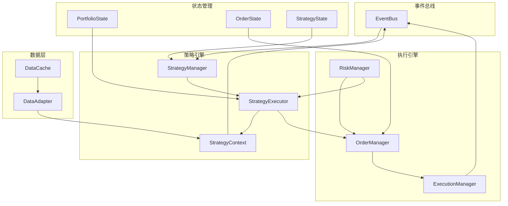

# 策略执行引擎设计

## 1. 设计目标

### 1.1 核心目标
1. **统一接口**：回测和实盘使用相同的策略执行接口
2. **事件驱动**：基于事件系统响应市场变化
3. **状态管理**：统一管理策略、订单、组合状态
4. **错误恢复**：健壮的错误处理和恢复机制
5. **性能优化**：支持并行执行和批量处理

### 1.2 设计原则
- **单一职责**：每个组件只负责一个功能
- **依赖注入**：通过配置切换执行模式
- **事件驱动**：所有操作通过事件触发
- **状态机驱动**：明确的状态流转规则
- **可观测性**：完善的监控和日志

## 2. 架构概览

### 2.1 组件关系图



### 2.2 核心组件

1. **StrategyManager**：策略生命周期管理
2. **StrategyExecutor**：策略执行和信号生成
3. **OrderManager**：订单管理和状态跟踪
4. **ExecutionManager**：订单执行和成交处理
5. **RiskManager**：风险控制和合规检查
6. **DataAdapter**：统一数据访问接口
7. **StateManager**：状态持久化和恢复

## 3. 策略管理器（StrategyManager）

### 3.1 职责
- 策略注册和注销
- 策略生命周期管理
- 策略配置管理
- 策略状态监控

### 3.2 接口设计

```python
class StrategyManager:
    """策略管理器"""
    
    def __init__(self, event_bus: EventBus, config: StrategyManagerConfig):
        self.event_bus = event_bus
        self.config = config
        self.strategies: Dict[str, StrategyInstance] = {}
        self.strategy_states: Dict[str, StrategyStateMachine] = {}
        
    async def register_strategy(self, strategy_config: StrategyConfig) -> str:
        """注册策略"""
        pass
    
    async def unregister_strategy(self, strategy_id: str) -> bool:
        """注销策略"""
        pass
    
    async def start_strategy(self, strategy_id: str) -> bool:
        """启动策略"""
        pass
    
    async def stop_strategy(self, strategy_id: str) -> bool:
        """停止策略"""
        pass
    
    async def pause_strategy(self, strategy_id: str) -> bool:
        """暂停策略"""
        pass
    
    async def resume_strategy(self, strategy_id: str) -> bool:
        """恢复策略"""
        pass
    
    async def update_strategy_config(self, strategy_id: str, config: Dict) -> bool:
        """更新策略配置"""
        pass
    
    async def get_strategy_status(self, strategy_id: str) -> Dict:
        """获取策略状态"""
        pass
    
    async def list_strategies(self, filter_criteria: Optional[Dict] = None) -> List[Dict]:
        """列出所有策略"""
        pass
```

### 3.3 策略实例管理

```python
@dataclass
class StrategyInstance:
    """策略实例"""
    strategy_id: str
    strategy_class: Type[UnifiedStrategy]
    config: StrategyConfig
    instance: UnifiedStrategy
    context: StrategyContext
    state_machine: StrategyStateMachine
    created_at: datetime
    last_activity: datetime
    
    # 性能指标
    signals_generated: int = 0
    orders_created: int = 0
    errors_count: int = 0
    total_runtime: float = 0.0  # 秒
    
    def update_activity(self):
        """更新活动时间"""
        self.last_activity = datetime.utcnow()
    
    def record_signal(self):
        """记录信号生成"""
        self.signals_generated += 1
        self.update_activity()
    
    def record_order(self):
        """记录订单创建"""
        self.orders_created += 1
        self.update_activity()
    
    def record_error(self):
        """记录错误"""
        self.errors_count += 1
        self.update_activity()
```

## 4. 策略执行器（StrategyExecutor）

### 4.1 职责
- 策略实例执行
- 信号生成和验证
- 事件处理
- 性能监控

### 4.2 接口设计

```python
class StrategyExecutor:
    """策略执行器"""
    
    def __init__(self, event_bus: EventBus, data_adapter: DataAdapter, 
                 portfolio_manager: PortfolioManager):
        self.event_bus = event_bus
        self.data_adapter = data_adapter
        self.portfolio_manager = portfolio_manager
        self.executing_strategies: Dict[str, asyncio.Task] = {}
        
    async def execute_strategy(self, strategy_instance: StrategyInstance) -> bool:
        """执行策略"""
        # 1. 准备策略上下文
        context = await self._prepare_context(strategy_instance)
        
        # 2. 调用策略初始化
        await self._initialize_strategy(strategy_instance, context)
        
        # 3. 开始事件处理循环
        task = asyncio.create_task(
            self._strategy_event_loop(strategy_instance, context)
        )
        self.executing_strategies[strategy_instance.strategy_id] = task
        
        return True
    
    async def _strategy_event_loop(self, strategy_instance: StrategyInstance, 
                                  context: StrategyContext):
        """策略事件处理循环"""
        try:
            # 订阅相关事件
            await self._subscribe_events(strategy_instance)
            
            # 主事件处理循环
            while strategy_instance.state_machine.current_state == StrategyState.RUNNING:
                try:
                    # 处理事件队列
                    await self._process_event_queue(strategy_instance, context)
                    
                    # 检查超时
                    await self._check_timeouts(strategy_instance)
                    
                    # 短暂休眠避免CPU占用过高
                    await asyncio.sleep(0.001)
                    
                except asyncio.CancelledError:
                    break
                except Exception as e:
                    await self._handle_strategy_error(strategy_instance, e)
                    
        finally:
            # 清理资源
            await self._cleanup_strategy(strategy_instance)
    
    async def _process_market_event(self, event: MarketEvent, 
                                   strategy_instance: StrategyInstance,
                                   context: StrategyContext):
        """处理市场事件"""
        # 1. 更新上下文
        context.current_time = event.timestamp
        context.market_data = event.data
        
        # 2. 调用策略事件处理方法
        signals = await strategy_instance.instance.on_market_event(event, context)
        
        # 3. 验证和处理信号
        for signal in signals:
            await self._process_signal(signal, strategy_instance, context)
    
    async def _process_signal(self, signal: Signal, 
                             strategy_instance: StrategyInstance,
                             context: StrategyContext):
        """处理策略信号"""
        # 1. 信号验证
        if not await self._validate_signal(signal, strategy_instance, context):
            return
        
        # 2. 记录信号
        strategy_instance.record_signal()
        
        # 3. 生成订单意图
        order_intent = await strategy_instance.instance.calculate_position_size(
            signal, context.portfolio_state, context.risk_state, context
        )
        
        # 4. 发布订单事件
        order_event = OrderCreatedEvent(
            order_id=str(uuid.uuid4()),
            symbol=order_intent.symbol,
            order_type=order_intent.order_type,
            side=order_intent.side,
            quantity=order_intent.quantity,
            strategy_id=strategy_instance.strategy_id,
            limit_price=order_intent.limit_price,
            stop_price=order_intent.stop_price,
            data={"signal": signal.to_dict()}
        )
        
        await self.event_bus.publish(order_event)
```

## 5. 订单管理器（OrderManager）

### 5.1 职责
- 订单创建和验证
- 订单状态跟踪
- 订单生命周期管理
- 订单路由和分配

### 5.2 接口设计

```python
class OrderManager:
    """订单管理器"""
    
    def __init__(self, event_bus: EventBus, risk_manager: RiskManager):
        self.event_bus = event_bus
        self.risk_manager = risk_manager
        self.orders: Dict[str, Order] = {}
        self.order_state_machines: Dict[str, OrderStateMachine] = {}
        
    async def create_order(self, order_event: OrderCreatedEvent) -> Optional[str]:
        """创建订单"""
        # 1. 验证订单
        validation_result = await self._validate_order(order_event)
        if not validation_result["valid"]:
            await self._reject_order(order_event, validation_result["reason"])
            return None
        
        # 2. 创建订单对象
        order = Order.from_event(order_event)
        self.orders[order.order_id] = order
        
        # 3. 初始化状态机
        state_machine = OrderStateMachine(order.order_id)
        self.order_state_machines[order.order_id] = state_machine
        
        # 4. 风险检查
        risk_check = await self.risk_manager.check_order_risk(order)
        if not risk_check["approved"]:
            await self._reject_order(order_event, f"风险检查失败: {risk_check['reason']}")
            return None
        
        # 5. 状态转移到验证通过
        state_machine.transition(OrderState.VALIDATED, "order_validated")
        
        # 6. 发布订单验证事件
        validated_event = OrderValidatedEvent(
            order_id=order.order_id,
            symbol=order.symbol,
            order_type=order.order_type,
            side=order.side,
            quantity=order.quantity,
            strategy_id=order.strategy_id,
            data={"validation_result": validation_result}
        )
        await self.event_bus.publish(validated_event)
        
        return order.order_id
    
    async def submit_order(self, order_id: str) -> bool:
        """提交订单到执行引擎"""
        if order_id not in self.orders:
            return False
        
        order = self.orders[order_id]
        state_machine = self.order_state_machines[order_id]
        
        # 检查状态
        if not state_machine.can_transition(OrderState.SUBMITTING):
            return False
        
        # 状态转移
        state_machine.transition(OrderState.SUBMITTING, "submitting_to_executor")
        
        try:
            # 提交到执行引擎
            submission_result = await self.execution_manager.submit_order(order)
            
            if submission_result["success"]:
                state_machine.transition(OrderState.SUBMITTED, "submitted_to_broker")
                
                # 发布提交事件
                submitted_event = OrderSubmittedEvent(
                    order_id=order_id,
                    symbol=order.symbol,
                    order_type=order.order_type,
                    side=order.side,
                    quantity=order.quantity,
                    strategy_id=order.strategy_id,
                    broker_order_id=submission_result.get("broker_order_id"),
                    submit_time=datetime.utcnow()
                )
                await self.event_bus.publish(submitted_event)
                
                return True
            else:
                state_machine.transition(OrderState.ERROR, f"提交失败: {submission_result['error']}")
                return False
                
        except Exception as e:
            state_machine.transition(OrderState.ERROR, f"提交异常: {str(e)}")
            return False
    
    async def cancel_order(self, order_id: str, reason: str = "") -> bool:
        """取消订单"""
        pass
    
    async def get_order_status(self, order_id: str) -> Dict:
        """获取订单状态"""
        pass
    
    async def list_orders(self, filter_criteria: Optional[Dict] = None) -> List[Dict]:
        """列出订单"""
        pass
```

## 6. 执行管理器（ExecutionManager）

### 6.1 职责
- 订单执行路由
- 执行器管理
- 成交处理
- 执行成本计算

### 6.2 接口设计

```python
class ExecutionManager:
    """执行管理器"""
    
    def __init__(self, event_bus: EventBus, config: ExecutionConfig):
        self.event_bus = event_bus
        self.config = config
        self.executors: Dict[str, BaseExecutor] = {}
        self.order_executor_map: Dict[str, str] = {}  # order_id -> executor_id
        
    async def initialize(self):
        """初始化执行器"""
        # 根据配置创建执行器
        for executor_config in self.config.executors:
            executor = await self._create_executor(executor_config)
            self.executors[executor.executor_id] = executor
            
            # 启动执行器
            await executor.start()
    
    async def submit_order(self, order: Order) -> Dict:
        """提交订单到合适的执行器"""
        # 1. 选择执行器
        executor_id = await self._select_executor(order)
        
        if executor_id not in self.executors:
            return {"success": False, "error": f"执行器不存在: {executor_id}"}
        
        # 2. 记录映射关系
        self.order_executor_map[order.order_id] = executor_id
        
        # 3. 提交订单
        executor = self.executors[executor_id]
        try:
            result = await executor.submit_order(order)
            return result
        except Exception as e:
            return {"success": False, "error": str(e)}
    
    async def _select_executor(self, order: Order) -> str:
        """选择执行器"""
        # 根据订单属性选择执行器
        # 1. 回测模式使用模拟执行器
        if self.config.mode == "backtest":
            return "simulated_executor"
        
        # 2. 实盘模式根据标的和订单类型选择
        if order.symbol.endswith(".US"):
            return "ib_executor"
        elif order.symbol.endswith(".HK"):
            return "futu_executor"
        else:
            return "default_executor"
    
    async def process_fill(self, fill_event: OrderFilledEvent):
        """处理成交事件"""
        # 1. 更新订单状态
        order_id = fill_event.order_id
        if order_id in self.order_executor_map:
            executor_id = self.order_executor_map[order_id]
            executor = self.executors[executor_id]
            
            # 2. 通知执行器
            await executor.process_fill(fill_event)
            
            # 3. 发布成交事件
            await self.event_bus.publish(fill_event)
            
            # 4. 清理完成的订单映射
            if fill_event.fill_quantity >= self.orders[order_id].quantity:
                self.order_executor_map.pop(order_id, None)
```

## 7. 执行器基类（BaseExecutor）

### 7.1 模拟执行器（SimulatedExecutor）

```python
class SimulatedExecutor(BaseExecutor):
    """模拟执行器（用于回测）"""
    
    def __init__(self, config: SimulatedExecutorConfig):
        super().__init__(config)
        self.cost_model = CostModel(config.commission_rate, config.slippage_rate)
        self.market_data: Dict[str, pd.DataFrame] = {}
        
    async def submit_order(self, order: Order) -> Dict:
        """提交订单（模拟立即成交）"""
        # 1. 获取当前价格
        current_price = await self._get_current_price(order.symbol, order.order_type)
        
        if current_price is None:
            return {"success": False, "error": "无法获取价格"}
        
        # 2. 计算成交价格（考虑滑点）
        fill_price = self.cost_model.apply_slippage(
            current_price, order.side, order.quantity
        )
        
        # 3. 计算手续费
        commission = self.cost_model.calculate_commission(
            order.quantity, fill_price, order.side
        )
        
        # 4. 创建成交事件
        fill_event = OrderFilledEvent(
            order_id=order.order_id,
            symbol=order.symbol,
            order_type=order.order_type,
            side=order.side,
            quantity=order.quantity,
            fill_id=str(uuid.uuid4()),
            fill_price=fill_price,
            fill_quantity=order.quantity,
            fill_time=datetime.utcnow(),
            commission=commission,
            slippage=abs(fill_price - current_price),
            liquidity="simulated"
        )
        
        # 5. 立即发布成交事件
        await self.event_bus.publish(fill_event)
        
        return {
            "success": True,
            "broker_order_id": f"simulated_{order.order_id}",
            "fill_price": fill_price
        }
    
    async def _get_current_price(self, symbol: str, order_type: str) -> Optional[float]:
        """获取当前价格"""
        # 根据订单类型获取价格
        if order_type == "market":
            # 市价单使用最新收盘价
            if symbol in self.market_data and not self.market_data[symbol].empty:
                return self.market_data[symbol].iloc[-1]["close"]
        elif order_type == "limit":
