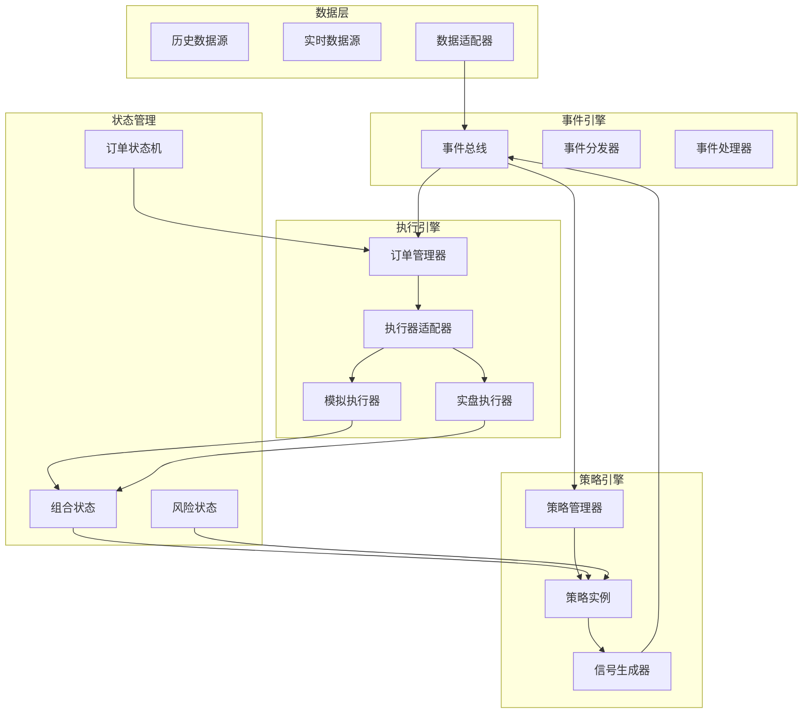

# 统一事件驱动架构设计

## 1. 当前系统问题分析

### 1.1 回测与交易流程差异

**回测流程（BacktestEngine）**：
- 混合模式：向量化预计算 + 事件驱动执行
- 数据访问：全量历史数据，存在前视偏差风险
- 订单执行：立即撮合，简化成本模型
- 时间处理：三种时钟模式（daily/bar/hybrid）
- 策略接口：Freqtrade风格向量化方法 + 事件驱动方法

**实盘交易流程（IBBroker）**：
- 纯事件驱动：响应市场事件
- 数据访问：实时流数据，无未来数据
- 订单执行：异步提交，等待成交确认
- 时间处理：实时时钟，事件触发
- 策略接口：事件驱动方法为主

### 1.2 主要差异点

| 维度 | 回测 | 实盘 | 影响 |
|------|------|------|------|
| 数据访问 | 全量历史数据 | 实时流数据 | 前视偏差风险 |
| 时间处理 | 批量时间轴 | 实时事件 | 执行时机差异 |
| 订单执行 | 立即撮合 | 异步等待 | 成交价格差异 |
| 成本模型 | 简化计算 | 实际费用 | 收益计算偏差 |
| 状态管理 | 内存状态 | 持久化状态 | 状态一致性 |
| 错误处理 | 忽略网络错误 | 处理连接问题 | 健壮性差异 |

## 2. 统一架构设计目标

### 2.1 核心目标
1. **流程一致性**：回测和实盘使用相同的核心引擎
2. **事件驱动**：统一的事件处理机制
3. **数据隔离**：历史数据源 vs 实时数据源
4. **状态同步**：相同的状态机和生命周期
5. **可扩展性**：支持多种数据源和执行器

### 2.2 设计原则
- **单一职责**：每个组件只负责一个功能
- **依赖注入**：通过配置切换回测/实盘模式
- **事件总线**：统一的事件通信机制
- **状态机驱动**：明确的订单和策略状态流转

## 3. 统一事件驱动架构

### 3.1 架构概览



### 3.2 核心组件设计

#### 3.2.1 事件引擎（EventEngine）
- **职责**：统一的事件分发和处理
- **特性**：
  - 支持优先级队列
  - 异步事件处理
  - 事件订阅/发布机制
  - 事件历史记录

#### 3.2.2 数据适配器（DataAdapter）
- **职责**：统一数据访问接口
- **实现**：
  - `HistoricalDataAdapter`：回测数据源
  - `LiveDataAdapter`：实时数据源
  - 统一的数据格式和接口

#### 3.2.3 策略引擎（StrategyEngine）
- **职责**：策略管理和执行
- **特性**：
  - 统一的策略接口
  - 策略生命周期管理
  - 信号生成和验证
  - 参数优化支持

#### 3.2.4 执行引擎（ExecutionEngine）
- **职责**：订单执行和管理
- **实现**：
  - `SimulatedExecutor`：回测执行器
  - `LiveExecutor`：实盘执行器
  - 统一的订单状态机

#### 3.2.5 状态管理器（StateManager）
- **职责**：系统状态管理
- **管理对象**：
  - 组合状态（PortfolioState）
  - 风险状态（RiskState）
  - 订单状态（OrderState）
  - 系统状态（SystemState）

## 4. 事件类型定义

### 4.1 市场事件
```python
class MarketEvent(Event):
    """市场数据事件"""
    event_type = "market"
    
    def __init__(self, symbol: str, data: MarketData, timestamp: datetime):
        self.symbol = symbol
        self.data = data
        self.timestamp = timestamp
```

### 4.2 策略事件
```python
class SignalEvent(Event):
    """策略信号事件"""
    event_type = "signal"
    
    def __init__(self, signal: Signal, strategy_id: str, timestamp: datetime):
        self.signal = signal
        self.strategy_id = strategy_id
        self.timestamp = timestamp

class StrategyStatusEvent(Event):
    """策略状态事件"""
    event_type = "strategy_status"
    
    def __init__(self, strategy_id: str, status: str, metadata: dict):
        self.strategy_id = strategy_id
        self.status = status
        self.metadata = metadata
```

### 4.3 订单事件
```python
class OrderEvent(Event):
    """订单事件基类"""
    event_type = "order"
    
    def __init__(self, order_id: str, order: OrderIntent, timestamp: datetime):
        self.order_id = order_id
        self.order = order
        self.timestamp = timestamp

class OrderCreatedEvent(OrderEvent):
    """订单创建事件"""
    event_type = "order_created"

class OrderSubmittedEvent(OrderEvent):
    """订单提交事件"""
    event_type = "order_submitted"

class OrderFilledEvent(OrderEvent):
    """订单成交事件"""
    event_type = "order_filled"
    
    def __init__(self, order_id: str, order: OrderIntent, fill: Fill, timestamp: datetime):
        super().__init__(order_id, order, timestamp)
        self.fill = fill

class OrderCancelledEvent(OrderEvent):
    """订单取消事件"""
    event_type = "order_cancelled"
    
    def __init__(self, order_id: str, order: OrderIntent, reason: str, timestamp: datetime):
        super().__init__(order_id, order, timestamp)
        self.reason = reason
```

### 4.4 系统事件
```python
class SystemEvent(Event):
    """系统事件"""
    event_type = "system"
    
    def __init__(self, event_type: str, data: dict, timestamp: datetime):
        self.system_event_type = event_type
        self.data = data
        self.timestamp = timestamp

class TimerEvent(SystemEvent):
    """定时器事件"""
    event_type = "timer"
    
    def __init__(self, timer_id: str, interval: timedelta, timestamp: datetime):
        super().__init__("timer", {"timer_id": timer_id, "interval": interval}, timestamp)
        self.timer_id = timer_id
        self.interval = interval
```

## 5. 统一策略接口

### 5.1 策略基类设计
```python
class UnifiedStrategy(ABC):
    """统一策略接口"""
    
    def __init__(self, config: StrategyConfig):
        self.config = config
        self.strategy_id = config.strategy_id
        self.mode = "backtest"  # 或 "live"
        
    # 数据准备方法（向量化）
    @abstractmethod
    def prepare_data(self, data_adapter: DataAdapter) -> Dict[str, pd.DataFrame]:
        """准备策略所需数据"""
        pass
    
    # 事件处理方法（事件驱动）
    @abstractmethod
    def on_market_event(self, event: MarketEvent, context: StrategyContext) -> List[Signal]:
        """处理市场事件"""
        pass
    
    @abstractmethod
    def on_timer_event(self, event: TimerEvent, context: StrategyContext) -> List[Signal]:
        """处理定时器事件"""
        pass
    
    # 仓位管理方法
    @abstractmethod
    def calculate_position_size(self, signal: Signal, portfolio: PortfolioState, 
                               risk: RiskState, context: StrategyContext) -> OrderIntent:
        """计算仓位大小"""
        pass
    
    # 生命周期方法
    def on_start(self, context: StrategyContext):
        """策略启动"""
        pass
    
    def on_stop(self, context: StrategyContext):
        """策略停止"""
        pass
    
    def on_error(self, error: Exception, context: StrategyContext):
        """错误处理"""
        pass
```

### 5.2 策略上下文
```python
@dataclass
class StrategyContext:
    """策略执行上下文"""
    mode: str  # "backtest" 或 "live"
    current_time: datetime
    data_adapter: DataAdapter
    portfolio_state: PortfolioState
    risk_state: RiskState
    config: dict
    cross_section: Optional[Dict[str, Dict]] = None
    metadata: Dict[str, Any] = field(default_factory=dict)
```

## 6. 执行引擎设计

### 6.1 统一执行接口
```python
class ExecutionEngine(ABC):
    """执行引擎基类"""
    
    def __init__(self, mode: str, config: ExecutionConfig):
        self.mode = mode  # "simulated" 或 "live"
        self.config = config
        self.order_manager = OrderManager()
        
    @abstractmethod
    async def submit_order(self, order: OrderIntent, context: ExecutionContext) -> str:
        """提交订单"""
        pass
    
    @abstractmethod
    async def cancel_order(self, order_id: str, context: ExecutionContext) -> bool:
        """取消订单"""
        pass
    
    @abstractmethod
    async def get_order_status(self, order_id: str, context: ExecutionContext) -> OrderStatus:
        """获取订单状态"""
        pass
    
    @abstractmethod
    async def poll_fills(self, context: ExecutionContext) -> List[Fill]:
        """轮询成交"""
        pass
    
    @abstractmethod
    async def get_portfolio_state(self, context: ExecutionContext) -> PortfolioState:
        """获取组合状态"""
        pass
```

### 6.2 订单状态机
```python
class OrderStateMachine:
    """订单状态机"""
    
    STATES = {
        "CREATED": {"transitions": ["SUBMITTED", "CANCELLED"]},
        "SUBMITTED": {"transitions": ["PARTIALLY_FILLED", "FILLED", "CANCELLED", "REJECTED"]},
        "PARTIALLY_FILLED": {"transitions": ["FILLED", "CANCELLED"]},
        "FILLED": {"transitions": []},
        "CANCELLED": {"transitions": []},
        "REJECTED": {"transitions": []},
    }
    
    def __init__(self, order_id: str):
        self.order_id = order_id
        self.current_state = "CREATED"
        self.history: List[Tuple[datetime, str, str]] = []  # (timestamp, from_state, to_state)
        
    def transition(self, new_state: str, timestamp: datetime) -> bool:
        """状态转换"""
        if new_state not in self.STATES[self.current_state]["transitions"]:
            return False
        
        self.history.append((timestamp, self.current_state, new_state))
        self.current_state = new_state
        return True
```

## 7. 数据流设计

### 7.1 回测数据流
```
历史数据源 → 数据适配器 → 时间轴生成器 → 市场事件 → 策略引擎 → 信号事件 → 执行引擎 → 成交事件 → 状态更新
```

### 7.2 实盘数据流
```
实时数据源 → 数据适配器 → 市场事件 → 策略引擎 → 信号事件 → 执行引擎 → 订单提交 → 券商接口 → 成交回调 → 状态更新
```

### 7.3 统一数据接口
```python
class DataAdapter(ABC):
    """数据适配器接口"""
    
    @abstractmethod
    async def get_historical_data(self, symbol: str, start: datetime, end: datetime, 
                                 timeframe: str) -> pd.DataFrame:
        """获取历史数据"""
        pass
    
    @abstractmethod
    async def subscribe_real_time(self, symbol: str, callback: Callable):
        """订阅实时数据"""
        pass
    
    @abstractmethod
    async def get_current_price(self, symbol: str) -> float:
        """获取当前价格"""
        pass
    
    @abstractmethod
    def get_available_data(self, symbol: str, timeframe: str) -> List[datetime]:
        """获取可用数据时间点"""
        pass
```

## 8. 配置系统

### 8.1 统一配置结构
```python
@dataclass
class UnifiedConfig:
    """统一配置"""
    mode: str  # "backtest" 或 "live"
    
    # 数据配置
    data_source: str  # "historical" 或 "live"
    data_adapter_config: dict
    
    # 策略配置
    strategies: List[StrategyConfig]
    
    # 执行配置
    execution_mode: str  # "simulated" 或 "live"
    execution_config: dict
    
    # 风险配置
    risk_config: dict
    
    # 时间配置
    start_time: datetime
    end_time: Optional[datetime] = None
    clock_mode: str = "hybrid"  # "daily", "bar", "hybrid"
    
    # 性能配置
    enable_parallel: bool = False
    max_workers: int = 4
```

## 9. 迁移路径

### 9.1 第一阶段：架构准备
1. 实现统一事件引擎
2. 创建数据适配器接口
3. 设计统一策略接口
4. 实现基础状态管理器

### 9.2 第二阶段：回测引擎重构
1. 基于新架构重构BacktestEngine
2. 实现模拟执行器
3. 迁移现有策略到新接口
4. 确保回测结果一致性

### 9.3 第三阶段：实盘引擎集成
1. 实现实时数据适配器
2. 集成IBBroker到新执行引擎
3. 实现实盘策略执行
4. 测试实盘回测一致性

### 9.4 第四阶段：优化和扩展
1. 性能优化
2. 监控和日志系统
3. 高级功能（如walk-forward优化）
4. 多市场支持

## 10. 预期收益

### 10.1 技术收益
- **一致性**：回测和实盘使用相同代码路径
- **可维护性**：统一架构减少代码重复
- **可测试性**：更容易编写单元测试和集成测试
- **可扩展性**：支持新的数据源和执行器

### 10.2 业务收益
- **准确性**：减少前视偏差，提高回测可信度
- **可靠性**：实盘交易更稳定
- **开发效率**：策略开发一次，回测实盘通用
- **风险控制**：统一的风险管理机制

## 11. 风险评估

### 11.1 技术风险
- **迁移复杂度**：现有代码重构工作量
- **性能影响**：事件驱动可能增加开销
- **兼容性问题**：现有策略需要适配

### 11.2 缓解措施
- **渐进式迁移**：分阶段实施，确保每个阶段可验证
- **并行运行**：新旧系统并行，对比结果
- **全面测试**：建立完善的测试套件
- **回滚计划**：准备快速回滚机制

## 12. 下一步行动

1. **详细设计**：完成每个组件的详细设计
2. **原型验证**：实现关键组件原型
3. **迁移计划**：制定具体的迁移时间表
4. **测试策略**：设计测试方案确保质量
5. **文档更新**：更新用户和开发文档